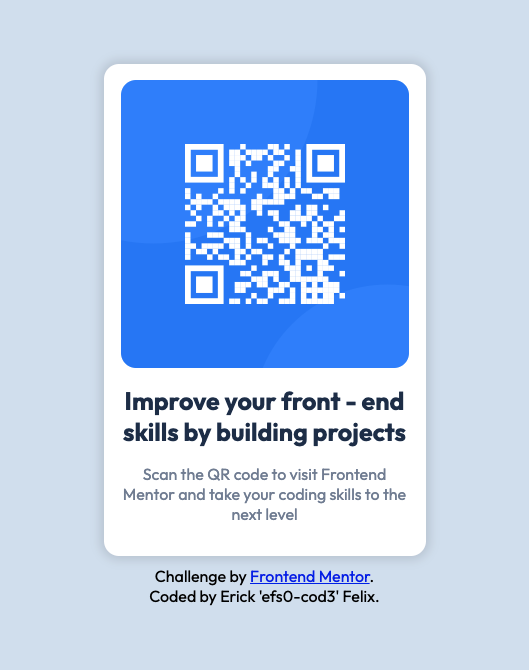

# Frontend Mentor - QR code component solution

This is a solution to the [QR code component challenge on Frontend Mentor](https://www.frontendmentor.io/challenges/qr-code-component-iux_sIO_H). Frontend Mentor challenges help you improve your coding skills by building realistic projects. 

## Table of contents

- [Overview](#overview)
  - [Screenshot](#screenshot)
  - [Links](#links)
- [My process](#my-process)
  - [Built with](#built-with)
  - [What I learned](#what-i-learned)
  - [Continued development](#continued-development)
- [Author](#author)

## Overview

### Screenshot

### Links

- Solution URL: [Add solution URL here](https://github.com/efs0-cod3/firstReactSite)
- Live Site URL: [Add live site URL here](https://efs0-cod3.github.io/firstReactSite/)

## My process

### Built with

- Semantic HTML5 markup
- CSS custom properties
- Flexbox
- [React](https://reactjs.org/) - JS library

### What I learned

A lot...

- First time using react for that reason a simple design was scary at first the was fluent..
- Learning that to import images have to be on the src folder.
- Used var for the css.

### Continued development

Will be implementing my knowledge on react making a little bit more complicated challenges.

## Author

- Website - [Erick Felix](erickfelix.netlify.app/)
- Frontend Mentor - [@efs0-cod3](https://www.frontendmentor.io/profile/efs0-cod3)
- Twitter - [@efs0_code](https://www.twitter.com/efs0_code)
